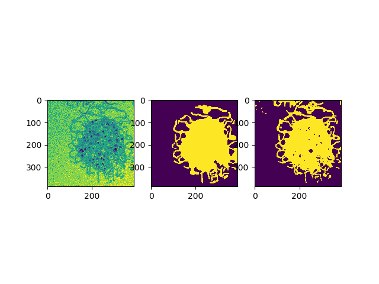

# Image Segmentation

### Active contour
This part is the implementation of Active Contour model [Snakes by Kass et al. (1988)](http://www.cs.ait.ac.th/~mdailey/cvreadings/Kass-Snakes.pdf).
run `cd active_contour`
run `main.m` in matlab

### Unet - deep learning
This part is the implementation of [U-Net by Ronneberger et al. (2015)](https://arxiv.org/abs/1505.04597).     
run `cd u-net`      
run `train.py` to train  
       

